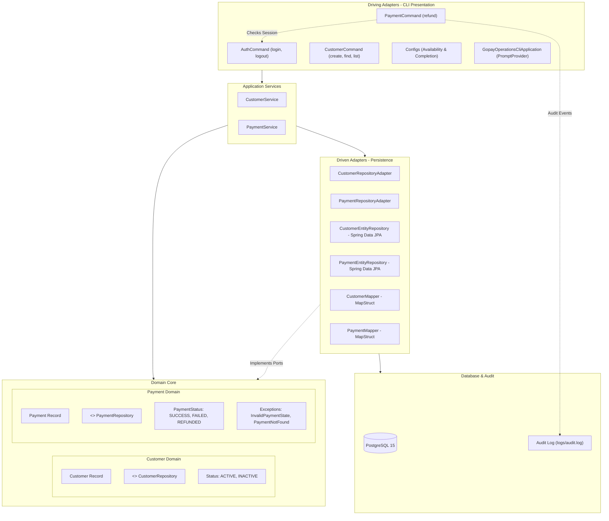

# GoPay Operations CLI (`gopay-operations-cli`)

[](https://openjdk.org/projects/jdk/21/)
[](https://spring.io/projects/spring-boot)
[](https://spring.io/projects/spring-shell)
[](https://www.postgresql.org/)
[](#architecture)

An interactive, terminal-based operations and back-office Command-Line Interface (CLI) for managing customers, controlling operator sessions, and processing payment refunds in the **GoPay** ecosystem.

Built with **Java 21**, **Spring Boot 4.1.1**, and **Spring Shell 4**, featuring rich terminal UI components powered by **JLine** (custom colored prompt, masked password inputs, interactive component flows, bordered data tables, dynamic command availability, autocompletion), structured using **Hexagonal Architecture** (Ports and Adapters), and backed by a dedicated audit logging system.

---

## Table of Contents

- [Features](#features)
- [Architecture](#architecture)
  - [Architectural Overview](#architectural-overview)
  - [Project Directory Structure](#project-directory-structure)
- [Tech Stack](#tech-stack)
- [Prerequisites](#prerequisites)
- [Getting Started](#getting-started)
  - [1. Start the PostgreSQL Database](#1-start-the-postgresql-database)
  - [2. Build the Application](#2-build-the-application)
  - [3. Run the CLI](#3-run-the-cli)
- [CLI Command Reference](#cli-command-reference)
  - [Authentication & Session Management](#authentication--session-management)
  - [Customer Management](#customer-management)
  - [Payment Operations](#payment-operations)
  - [General Commands & Shortcuts](#general-commands--shortcuts)
- [Logging & Audit Trail](#logging--audit-trail)
- [Configuration](#configuration)
  - [Spring Profiles](#spring-profiles)
  - [Environment Variables](#environment-variables)
  - [Application Configuration Files](#application-configuration-files)
- [Testing](#testing)
- [Contact](#contact)

---

## Features

- **Authentication & Dynamic Session Management**:
  - **Secure Password Prompt**: Masked password entry powered by JLine (`CommandContext.inputReader().readPassword()`).
  - **Session State Tracking**: Operator credentials validation (built-in `admin`/`admin` account) with in-memory session persistence.
  - **Dynamic Command Availability**: Commands dynamically enable or disable using Spring Shell `AvailabilityProvider`. `login` is disabled if already logged in; `logout` is disabled if not logged in.
- **Customer Operations**:
  - **Create**: Add new customers with input validation (`@NotBlank`, `@Email`) and status configuration (`ACTIVE` or `INACTIVE`, defaulting to `ACTIVE`).
  - **Find**: Retrieve single customer records by ID with color-coded status output.
  - **List & Filter**: Tabular rendering (`fancy_light` borders) of all customers or filtered by status (`--status ACTIVE|INACTIVE`).
  - **Smart Shell Autocompletion**: Auto-completion proposals (`Tab`) for flags, status enum values, and sample inputs (`createCustomerCompletionProvider`, `customerFilterCompletionProvider`).
- **Payment & Refund Operations**:
  - **Authentication Enforcement**: Refunds require an active operator session (`Unauthenticated! You need to login first`).
  - **State-aware Validation**: Verifies payment existence and ensures status is `SUCCESS` before permitting a refund.
  - **Interactive Terminal Prompts**: Guides operators through an interactive `ComponentFlow` to collect the refund reason and confirm the transaction before execution.
  - **Dedicated Audit Trail**: Successful refunds are logged to a segregated audit log (`logs/audit.log`) capturing the operator username, payment ID, and reason.
- **Terminal UI & Experience**:
  - **Custom Prompt**: Colored prompt (`gopay-sh:>` in green) defined via `PromptProvider`.
  - **Clean Terminal Output**: Non-error application and framework logs are redirected to files; only errors surface in the console to keep the shell clutter-free.
  - **Application Banner**: Custom ASCII art banner displaying the CLI version and Spring Boot runtime.
- **Hexagonal Architecture**: Strict decoupling of domain logic, application use cases, persistence adapters, and CLI presentation.
- **Containerized Database & Migrations**: Pre-configured `docker-compose.yml` for PostgreSQL 15 and automated Flyway schema migrations (`V1__create_customer_table.sql`, `V2__add_payment_table.sql`).

---

## Architecture

The project adheres to **Hexagonal Architecture** (Ports & Adapters / Clean Architecture):



### Architectural Overview

1. **Domain Layer (`com.gofar.gopay.domain`)**:
   - Pure business models and contracts with zero framework coupling.
   - Immutable records: [`Customer`](src/main/java/com/gofar/gopay/domain/customer/Customer.java), [`Payment`](src/main/java/com/gofar/gopay/domain/payment/Payment.java), and [`RefundDto`](src/main/java/com/gofar/gopay/domain/payment/RefundDto.java).
   - Domain repository interfaces (Ports): [`CustomerRepository`](src/main/java/com/gofar/gopay/domain/customer/CustomerRepository.java), [`PaymentRepository`](src/main/java/com/gofar/gopay/domain/payment/PaymentRepository.java).
   - Enums: [`Status`](src/main/java/com/gofar/gopay/domain/customer/Status.java), [`PaymentStatus`](src/main/java/com/gofar/gopay/domain/payment/PaymentStatus.java).
   - Domain business exceptions: [`PaymentNotFoundException`](src/main/java/com/gofar/gopay/domain/payment/PaymentNotFoundException.java), [`InvalidPaymentStateException`](src/main/java/com/gofar/gopay/domain/payment/InvalidPaymentStateException.java).

2. **Application Layer (`com.gofar.gopay.application`)**:
   - Orchestrates business use cases without exposing technical persistence details.
   - [`CustomerService`](src/main/java/com/gofar/gopay/application/customer/CustomerService.java): customer lookup, creation, listing all, and listing by status.
   - [`PaymentService`](src/main/java/com/gofar/gopay/application/payment/PaymentService.java): refund eligibility validation and execution.

3. **Infrastructure / Persistence Layer (`com.gofar.gopay.infrastructure.persistence`)**:
   - Adapters implementing domain ports: [`CustomerRepositoryAdapter`](src/main/java/com/gofar/gopay/infrastructure/persistence/customer/CustomerRepositoryAdapter.java), [`PaymentRepositoryAdapter`](src/main/java/com/gofar/gopay/infrastructure/persistence/payment/PaymentRepositoryAdapter.java).
   - JPA Entities: [`CustomerEntity`](src/main/java/com/gofar/gopay/infrastructure/persistence/customer/CustomerEntity.java), [`PaymentEntity`](src/main/java/com/gofar/gopay/infrastructure/persistence/payment/PaymentEntity.java).
   - Spring Data JPA repositories: [`CustomerEntityRepository`](src/main/java/com/gofar/gopay/infrastructure/persistence/customer/CustomerEntityRepository.java), [`PaymentEntityRepository`](src/main/java/com/gofar/gopay/infrastructure/persistence/payment/PaymentEntityRepository.java).
   - MapStruct mappers: [`CustomerMapper`](src/main/java/com/gofar/gopay/infrastructure/persistence/customer/CustomerMapper.java), [`PaymentMapper`](src/main/java/com/gofar/gopay/infrastructure/persistence/payment/PaymentMapper.java).

4. **CLI / Presentation Layer (`com.gofar.gopay.cli`)**:
   - [`AuthCommand`](src/main/java/com/gofar/gopay/cli/auth/AuthCommand.java): Handles `login` and `logout`, masked password prompts, and tracks the current authenticated operator session.
   - [`CustomerCommand`](src/main/java/com/gofar/gopay/cli/customer/CustomerCommand.java): Customer operations with JLine `TableBuilder` formatting (`fancy_light` borders) and status filtering.
   - [`PaymentCommand`](src/main/java/com/gofar/gopay/cli/payment/PaymentCommand.java): Interactive multi-step `ComponentFlow` for refunds, session verification, and SLF4J audit logging.
   - [`Configs`](src/main/java/com/gofar/gopay/cli/Configs.java): Declares `AvailabilityProvider` beans (`loginAvailabilityProvider`, `logoutAvailabilityProvider`) and `CompletionProvider` beans (`createCustomerCompletionProvider`, `customerFilterCompletionProvider`).
   - [`GopayOperationsCliApplication`](src/main/java/com/gofar/gopay/GopayOperationsCliApplication.java): Configures the custom green `gopay-sh:>` prompt.

### Project Directory Structure

```text
gopay-operations-cli/
├── docker/
│   ├── docker-compose.yml                               # PostgreSQL container setup
│   └── data/                                            # Mounted database volume (git ignored)
├── src/
│   ├── main/
│   │   ├── java/com/gofar/gopay/
│   │   │   ├── GopayOperationsCliApplication.java       # Boot entry point & custom prompt provider
│   │   │   ├── application/                             # Application services (use cases)
│   │   │   │   ├── customer/CustomerService.java
│   │   │   │   └── payment/PaymentService.java
│   │   │   ├── cli/                                     # Spring Shell presentation layer
│   │   │   │   ├── Configs.java                         # Availability & completion providers
│   │   │   │   ├── auth/AuthCommand.java                # Login & logout commands
│   │   │   │   ├── customer/CustomerCommand.java        # Customer management commands
│   │   │   │   └── payment/PaymentCommand.java          # Refund command & audit integration
│   │   │   ├── domain/                                  # Pure business records, ports & enums
│   │   │   │   ├── customer/
│   │   │   │   │   ├── Customer.java
│   │   │   │   │   ├── CustomerRepository.java
│   │   │   │   │   └── Status.java
│   │   │   │   └── payment/
│   │   │   │       ├── InvalidPaymentStateException.java
│   │   │   │       ├── Payment.java
│   │   │   │       ├── PaymentNotFoundException.java
│   │   │   │       ├── PaymentRepository.java
│   │   │   │       ├── PaymentStatus.java
│   │   │   │       └── RefundDto.java
│   │   │   └── infrastructure/persistence/              # Persistence adapters & JPA entities
│   │   │       ├── customer/
│   │   │       │   ├── CustomerEntity.java
│   │   │       │   ├── CustomerEntityRepository.java
│   │   │       │   ├── CustomerMapper.java
│   │   │       │   └── CustomerRepositoryAdapter.java
│   │   │       └── payment/
│   │   │           ├── PaymentEntity.java
│   │   │           ├── PaymentEntityRepository.java
│   │   │           ├── PaymentMapper.java
│   │   │           └── PaymentRepositoryAdapter.java
│   │   └── resources/
│   │       ├── banner.txt                               # Custom ASCII art banner
│   │       ├── application.yaml                         # Core configuration & active profile
│   │       ├── application-dev.yaml                     # Development datasource configuration
│   │       ├── application-prod.yaml                    # Production datasource configuration
│   │       ├── logback-spring.xml                       # Segregated rolling logs & audit appender
│   │       └── db/migration/                            # Flyway SQL migrations
│   │           ├── V1__create_customer_table.sql
│   │           └── V2__add_payment_table.sql
│   └── test/
│       └── java/com/gofar/gopay/
│           ├── application/PaymentServiceTest.java      # Application service unit tests
│           └── cli/                                     # Shell integration tests
│               ├── AuthCommandTest.java
│               ├── CustomerCommandTest.java
│               └── PaymentCommandTest.java
├── pom.xml                                              # Maven project descriptor
├── mvnw / mvnw.cmd                                      # Maven wrapper scripts
└── README.md
```

---

## Tech Stack

| Component | Technology | Version |
| :--- | :--- | :--- |
| **Language** | Java | 21 |
| **Framework** | Spring Boot | 4.1.1 |
| **CLI Framework** | Spring Shell | 4.0.3 |
| **Terminal UI** | Spring Shell JLine / JLine 3 | 4.0.x |
| **ORM & Data** | Spring Data JPA / Hibernate | 6.x |
| **Database** | PostgreSQL | 15 |
| **DB Migration** | Flyway | PostgreSQL Edition |
| **Code Generation** | MapStruct & Lombok | 1.6.3 / 1.18.46 |
| **Logging** | Logback / SLF4J (rolling files & audit) | Included |
| **Testing** | JUnit 5, Mockito, AssertJ, Spring Shell Test | Included |

---

## Prerequisites

- **Java Development Kit (JDK)**: Version 21 or higher installed and configured in `JAVA_HOME`.
- **Docker & Docker Compose**: Required for running the local PostgreSQL container.
- **Maven**: Version 3.9+ (or use the included `./mvnw` / `mvnw.cmd` wrapper).

---

## Getting Started

### 1. Start the PostgreSQL Database

Use Docker Compose to spin up the local PostgreSQL 15 instance:

```bash
docker compose -f docker/docker-compose.yml up -d
```

To verify the container is running:

```bash
docker ps --filter "name=gopay_ctn"
```

### 2. Build the Application

Build the application using the Maven wrapper:

**Linux / macOS:**
```bash
./mvnw clean package
```

**Windows (PowerShell / Command Prompt):**
```powershell
.\mvnw.cmd clean package
```

### 3. Run the CLI

#### Interactive Shell Mode (Default)

Launch the application:

**Using Maven:**
```bash
./mvnw spring-boot:run
```

**Using the compiled JAR:**
```bash
java -jar target/gopay-operations-cli-0.0.1-SNAPSHOT.jar
```

Once started, the application banner displays and the custom prompt appears:

```text
            .-'''-.                                                       _..._
           '   _    \                                                  .-'_..._''. .---.
         /   /` '.   \_________   _...._                             .' .'      '.\|   |.--.
  .--./).   |     \  '\        |.'      '-.         .-.          .- / .'           |   ||__|
 /.''\\ |   '      |  '\        .'```'.    '.        \ \        / /. '             |   |.--.
| |  | |\    \     / /  \      |       \     \   __   \ \      / / | |             |   ||  |
 \`-' /  `.   ` ..' /    |     |        |    |.:--.'.  \ \    / /  | |             |   ||  |
 /("'`      '-...-'`     |      \      /    ./ |   \ |  \ \  / /   . '             |   ||  |
 \ '---.                 |     |\`'-.-'   .' `" __ | |   \ `  /     \ '.          .|   ||  |
  /'""'.\                |     | '-....-'`    .'.''| |    \  /       '. `._____.-'/|   ||__|
 ||     ||              .'     '.            / /   | |_   / /          `-.______ / '---'
 \'. __//             '-----------'          \ \._,\ '/`-' /                    `
  `'---'                                      `--'  `" '..'
gopay-operations-cli 1.0
Powered by Spring Boot 4.1.1

gopay-sh:>
```

Type `help` to list all available commands.

#### Non-Interactive Execution

Run commands directly from your terminal by passing arguments to the JAR:

```bash
java -jar target/gopay-operations-cli-0.0.1-SNAPSHOT.jar customer list
```

---

## CLI Command Reference

### Authentication & Session Management

Session authentication manages operator privileges. Certain sensitive actions (such as payment refunds) require authentication.

#### 1. Login

Authenticates the operator. Prompts for the password interactively with masking.

```text
login -- <username>
```

- **Default credentials**: Username `admin` / Password `admin`
- **Dynamic Availability**: This command is only available when **not** logged in (`loginAvailabilityProvider`).

**Examples:**

*Successful login:*
```text
gopay-sh:> login -- admin
Password:
Welcome! Log in as admin successfully
```

*Failed credentials:*
```text
gopay-sh:> login -- admin
Password:
Error! Invalid username or password
```

*Already logged in:*
```text
gopay-sh:> login -- admin
Command 'login' is not currently available: You are already logged in
```

#### 2. Logout

Terminates the active session and clears the authenticated operator state.

```text
logout
```

- **Dynamic Availability**: This command is only available when an operator is currently logged in (`logoutAvailabilityProvider`).

**Examples:**

*Successful logout:*
```text
gopay-sh:> logout
Logout successfully
```

*When not logged in:*
```text
gopay-sh:> logout
Command 'logout' is not currently available: You are not logged in
```

---

### Customer Management

#### 1. Create a Customer

Registers a new customer. Requires name and email; status defaults to `ACTIVE` if omitted.

```text
customer create --name <name> --email <email> [--status ACTIVE|INACTIVE]
```

> [!TIP]
> Press `Tab` while typing this command to trigger `createCustomerCompletionProvider` autocompletion for `--name`, `--email`, and `--status` enum proposals (`ACTIVE`, `INACTIVE`).

**Examples:**
```text
gopay-sh:> customer create --name "John Doe" --email "john.doe@example.com"
Customer created: John Doe <john.doe@example.com> [ACTIVE] ✓

gopay-sh:> customer create --name "Acme Corp" --email "billing@acme.com" --status INACTIVE
Customer created: Acme Corp <billing@acme.com> [INACTIVE] ✓
```

#### 2. Find Customer by ID

Retrieves details for a single customer by numeric ID.

```text
customer find -- <id>
```

**Examples:**
```text
gopay-sh:> customer find -- 1
Customer #1: John Doe (ACTIVE)

gopay-sh:> customer find -- 999
Customer not found: 999
```

#### 3. List Customers (with Status Filter)

Renders customers in an ASCII/ANSI formatted table with headers. Optionally filter results by status using `--status`.

```text
customer list [--status ACTIVE|INACTIVE]
```

> [!TIP]
> Press `Tab` after `customer list --status` to trigger `customerFilterCompletionProvider` autocompletion with `ACTIVE` and `INACTIVE` proposals.

**List All Customers:**
```text
gopay-sh:> customer list
┌───┬───────────┬──────────────────────┬────────┐
│id │name       │email                 │status  │
├───┼───────────┼──────────────────────┼────────┤
│1  │John Doe   │john.doe@example.com  │ACTIVE  │
│2  │Acme Corp  │billing@acme.com      │INACTIVE│
└───┴───────────┴──────────────────────┴────────┘
```

**Filter by Status:**
```text
gopay-sh:> customer list --status ACTIVE
┌───┬───────────┬──────────────────────┬────────┐
│id │name       │email                 │status  │
├───┼───────────┼──────────────────────┼────────┤
│1  │John Doe   │john.doe@example.com  │ACTIVE  │
└───┴───────────┴──────────────────────┴────────┘
```

---

### Payment Operations

#### Refund a Payment

Initiates an interactive refund process for a target payment ID.

```text
payment refund -- <id>
```

**Execution Flow & Business Rules:**

1. **Authentication Check**: Verifies that the operator is logged in. If unauthenticated:
   ```text
   Unauthenticated! You need to login first
   ```
2. **Existence Validation**: Verifies that the payment ID exists in the database. If not found:
   ```text
   Payment with id <id> not found
   ```
3. **State Validation**: Checks that the payment status is currently `SUCCESS`. If it is already `REFUNDED` or `FAILED`:
   ```text
   Payment <id> cannot be refunded. Current status: REFUNDED
   ```
4. **Interactive ComponentFlow**: Prompts the operator for details:
   - **Reason**: Prompts operator to type a justification for the refund (`Reason:`).
   - **Confirmation**: Prompts operator with `Confirm refund ? (Y/n):`.
5. **Cancellation**: If the operator declines confirmation:
   ```text
   The refund was cancelled
   ```
6. **Execution & Audit Log**: If confirmed:
   - Updates payment status to `REFUNDED` in PostgreSQL.
   - Emits an audit entry in `logs/audit.log` via the `AUDIT` logger.
   - Displays confirmation:
     ```text
     Refund successful
     ```

**Interactive Example:**
```text
gopay-sh:> login -- admin
Password:
Welcome! Log in as admin successfully

gopay-sh:> payment refund -- 1
Reason: Customer requested cancellation
Confirm refund ? (Y/n): Y
Refund successful
```

---

### General Commands & Shortcuts

| Command | Description |
|:---|:---|
| `help [command]` | Displays help menu or detailed documentation for a specific command |
| `history` | Inspects previously executed shell commands in current session |
| `clear` or `cls` | Clears the terminal screen |
| `quit` or `exit` | Exits the CLI shell session |
| `Tab` | Triggers intelligent command and argument autocompletion |

---

## Logging & Audit Trail

The application uses an advanced SLF4J / Logback configuration defined in [`src/main/resources/logback-spring.xml`](src/main/resources/logback-spring.xml):

- **Clean Console Output**: A `ThresholdFilter` restricts console logs strictly to `ERROR` level, preventing Spring Boot or Hibernate log noise from interfering with the interactive shell.
- **Application Log (`logs/gopay.log`)**: All standard application events at `INFO` level and above are written to rolling files (`logs/gopay.%d{yyyy-MM-dd}.gz`, up to 30 days retention, 3GB cap).
- **Dedicated Audit Trail (`logs/audit.log`)**: Sensitive administrative actions (such as payment refunds) write directly to the `AUDIT` logger with `additivity="false"`:
  ```text
  12:30:15.123 [main] INFO  AUDIT - User admin refunded payment with id 1. Reason: Customer requested cancellation
  ```

---

## Configuration

### Spring Profiles

The project supports multi-profile setups via Spring Boot profiles:

| Profile | Configuration File | Purpose | Datasource Defaults |
|:---|:---|:---|:---|
| `dev` *(Default)* | [`application-dev.yaml`](src/main/resources/application-dev.yaml) | Local developer environment | Default `localhost:5432`, DB `ops_gopay_db`, User `tountoun` |
| `prod` | [`application-prod.yaml`](src/main/resources/application-prod.yaml) | Production deployment | Requires explicit environment variables |

To run with the production profile:
```bash
java -Dspring.profiles.active=prod -jar target/gopay-operations-cli-0.0.1-SNAPSHOT.jar
```

### Environment Variables

The application can be configured dynamically using environment variables:

| Variable | Description | `dev` Profile Default | `prod` Profile Default |
|:---|:---|:---|:---|
| `HOST` | PostgreSQL server hostname | `localhost` | *(Required)* |
| `PORT` | PostgreSQL server port | `5432` | *(Required)* |
| `DB` | Target PostgreSQL database name | `ops_gopay_db` | *(Required)* |
| `DB_USERNAME` | Database username | `tountoun` | *(Required)* |
| `DB_PASSWORD` | Database password | `tountoun` | *(Required)* |

### Application Configuration Files

**Core Configuration ([`src/main/resources/application.yaml`](src/main/resources/application.yaml)):**
```yaml
spring:
  application:
    name: gopay-operations-cli
    version: 1.0
  profiles:
    active:
      - dev
  jpa:
    hibernate:
      ddl-auto: validate
    properties:
      hibernate:
        dialect: org.hibernate.dialect.PostgreSQLDialect
  flyway:
    enabled: true

logging:
  file:
    path: logs
```

---

## Testing

The project contains unit and integration tests covering the domain logic, interactive Spring Shell commands, availability providers, and session authentication:

- **Domain / Service Unit Tests**:
  - [`PaymentServiceTest`](src/test/java/com/gofar/gopay/application/PaymentServiceTest.java): Verifies payment lookups, refundable assertions, and status transitions.
- **Shell Command Integration Tests**:
  - [`AuthCommandTest`](src/test/java/com/gofar/gopay/cli/AuthCommandTest.java): Uses Spring Shell `ShellTestClient` and `ShellInputProvider` to test valid/invalid logins, masked password input, and dynamic availability providers (`loginAvailabilityProvider`, `logoutAvailabilityProvider`).
  - [`CustomerCommandTest`](src/test/java/com/gofar/gopay/cli/CustomerCommandTest.java): Verifies command routing, table generation, and data representation.
  - [`PaymentCommandTest`](src/test/java/com/gofar/gopay/cli/PaymentCommandTest.java): Verifies authentication gating (`Unauthenticated`), payment not found handling, and refundable status checking.

### Run All Tests

```bash
./mvnw test
```

### Run a Specific Test Class

```bash
./mvnw test -Dtest=AuthCommandTest
./mvnw test -Dtest=PaymentCommandTest
./mvnw test -Dtest=CustomerCommandTest
./mvnw test -Dtest=PaymentServiceTest
```

---

## Contact

Feel free to join me at [tountounabela@gmail.com](mailto:tountounabela@gmail.com)