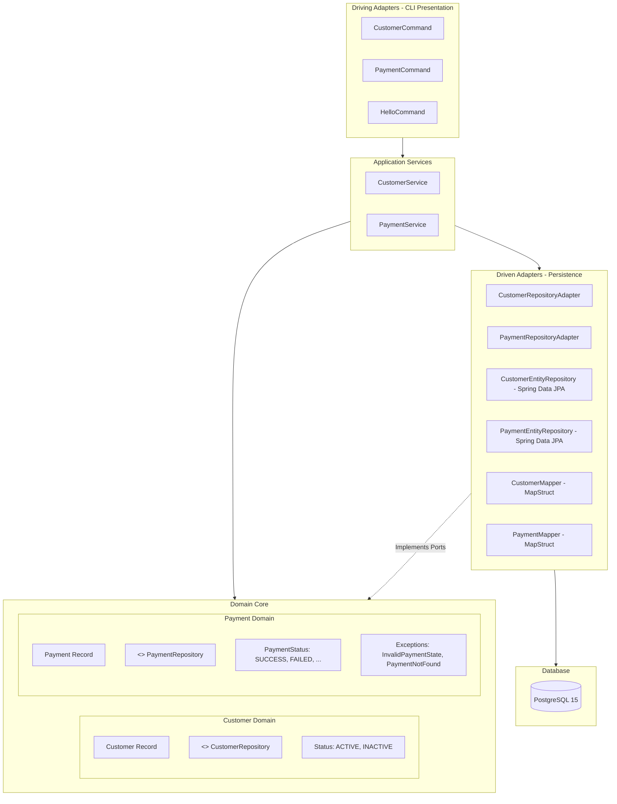

# GoPay Operations CLI (`gopay-operations-cli`)

[](https://openjdk.org/projects/jdk/21/)
[](https://spring.io/projects/spring-boot)
[](https://spring.io/projects/spring-shell)
[](https://www.postgresql.org/)
[](#architecture)

An interactive, terminal-based operations and back-office Command-Line Interface (CLI) for managing customers and processing payment refunds in the **GoPay** ecosystem.

Built with **Java 21**, **Spring Boot 4.1.1**, and **Spring Shell 4**, featuring rich terminal UI components powered by **JLine** (interactive component flows, bordered data tables, and ANSI colored feedback), structured using **Hexagonal Architecture** (Ports and Adapters).

---

## Table of Contents

- [Features](#features)
- [Architecture](#architecture)
  - [Architectural Overview](#architectural-overview)
  - [Project Directory Structure](#project-directory-structure)
- [Tech Stack](#tech-stack)
- [Prerequisites](#prerequisites)
- [Getting Started](#getting-started)
  - [1. Start the PostgreSQL Database](#1-start-the-postgresql-database)
  - [2. Build the Application](#2-build-the-application)
  - [3. Run the CLI](#3-run-the-cli)
- [CLI Command Reference](#cli-command-reference)
  - [Customer Management](#customer-management)
  - [Payment Operations](#payment-operations)
  - [General Commands](#general-commands)
- [Configuration](#configuration)
  - [Environment Variables](#environment-variables)
  - [Application Configuration](#application-configuration)
- [Testing](#testing)
- [License](#license)

---

## Features

- **Customer Operations**:
  - **Create**: Add new customers with validation (`@NotBlank`, `@Email`) and configurable status (`ACTIVE` or `INACTIVE`).
  - **Find**: Retrieve single customer records by ID with color-coded status output.
  - **List**: Display all customer records inside an ASCII/ANSI formatted table (`fancy_light` borders).
- **Payment & Refund Operations**:
  - **State-aware Refund Processing**: Validates that target payments exist and are in `SUCCESS` status before allowing refund operations.
  - **Interactive Terminal Prompts**: Guides operators through an interactive prompt flow (`ComponentFlow`) to collect refund reason and require confirmation before executing.
- **Hexagonal Architecture**: Strict decoupling of domain logic, application use cases, persistence adapters, and CLI presentation.
- **Containerized Database**: Pre-configured `docker-compose.yml` for PostgreSQL 15.
- **Database Migrations**: Integrated Flyway support for database version control and schema evolution.

---

## Architecture

The project adheres to **Hexagonal Architecture** (also known as Ports & Adapters / Clean Architecture):



### Architectural Overview

1. **Domain Layer (`com.gofar.gopay.domain`)**:
   - Pure business models and contracts with no framework coupling.
   - Immutable records: [`Customer`](src/main/java/com/gofar/gopay/domain/customer/Customer.java), [`Payment`](src/main/java/com/gofar/gopay/domain/payment/Payment.java), and [`RefundDto`](src/main/java/com/gofar/gopay/domain/payment/RefundDto.java).
   - Domain repository interfaces (Ports): [`CustomerRepository`](src/main/java/com/gofar/gopay/domain/customer/CustomerRepository.java), [`PaymentRepository`](src/main/java/com/gofar/gopay/domain/payment/PaymentRepository.java).
   - Domain business exceptions: [`PaymentNotFoundException`](src/main/java/com/gofar/gopay/domain/payment/PaymentNotFoundException.java), [`InvalidPaymentStateException`](src/main/java/com/gofar/gopay/domain/payment/InvalidPaymentStateException.java).

2. **Application Layer (`com.gofar.gopay.application`)**:
   - Orchestrates business use cases without exposing technical persistence details.
   - [`CustomerService`](src/main/java/com/gofar/gopay/application/customer/CustomerService.java): customer lookup, creation, and listing.
   - [`PaymentService`](src/main/java/com/gofar/gopay/application/payment/PaymentService.java): refund eligibility validation and execution.

3. **Infrastructure / Persistence Layer (`com.gofar.gopay.infrastructure.persistence`)**:
   - Adapters implementing domain ports: [`CustomerRepositoryAdapter`](src/main/java/com/gofar/gopay/infrastructure/persistence/customer/CustomerRepositoryAdapter.java), [`PaymentRepositoryAdapter`](src/main/java/com/gofar/gopay/infrastructure/persistence/payment/PaymentRepositoryAdapter.java).
   - JPA Entities: [`CustomerEntity`](src/main/java/com/gofar/gopay/infrastructure/persistence/customer/CustomerEntity.java), [`PaymentEntity`](src/main/java/com/gofar/gopay/infrastructure/persistence/payment/PaymentEntity.java).
   - Spring Data JPA repositories: [`CustomerEntityRepository`](src/main/java/com/gofar/gopay/infrastructure/persistence/customer/CustomerEntityRepository.java), [`PaymentEntityRepository`](src/main/java/com/gofar/gopay/infrastructure/persistence/payment/PaymentEntityRepository.java).
   - MapStruct mappers: [`CustomerMapper`](src/main/java/com/gofar/gopay/infrastructure/persistence/customer/CustomerMapper.java), [`PaymentMapper`](src/main/java/com/gofar/gopay/infrastructure/persistence/payment/PaymentMapper.java).

4. **CLI / Presentation Layer (`com.gofar.gopay.cli`)**:
   - Spring Shell command handlers annotated with `@Command`.
   - Uses JLine TUI components: [`TableBuilder`](src/main/java/com/gofar/gopay/cli/customer/CustomerCommand.java) for formatted table views and [`ComponentFlow`](src/main/java/com/gofar/gopay/cli/payment/PaymentCommand.java) for multi-step interactive prompts.

### Project Directory Structure

```text
gopay-operations-cli/
├── docker/
│   ├── docker-compose.yml        # PostgreSQL container setup
│   └── data/                     # Mounted database volume (ignored)
├── src/
│   ├── main/
│   │   ├── java/com/gofar/gopay/
│   │   │   ├── GopayOperationsCliApplication.java   # Spring Boot entry point
│   │   │   ├── HelloCommand.java                    # Base test command
│   │   │   ├── application/                         # Use case services
│   │   │   │   ├── customer/CustomerService.java
│   │   │   │   └── payment/PaymentService.java
│   │   │   ├── cli/                                 # Spring Shell commands
│   │   │   │   ├── customer/CustomerCommand.java
│   │   │   │   └── payment/PaymentCommand.java
│   │   │   ├── domain/                              # Domain records, ports & enums
│   │   │   │   ├── customer/
│   │   │   │   │   ├── Customer.java
│   │   │   │   │   ├── CustomerRepository.java
│   │   │   │   │   └── Status.java
│   │   │   │   └── payment/
│   │   │   │       ├── InvalidPaymentStateException.java
│   │   │   │       ├── Payment.java
│   │   │   │       ├── PaymentNotFoundException.java
│   │   │   │       ├── PaymentRepository.java
│   │   │   │       ├── PaymentStatus.java
│   │   │   │       └── RefundDto.java
│   │   │   └── infrastructure/persistence/          # JPA & adapter implementations
│   │   │       ├── customer/
│   │   │       │   ├── CustomerEntity.java
│   │   │       │   ├── CustomerEntityRepository.java
│   │   │       │   ├── CustomerMapper.java
│   │   │       │   └── CustomerRepositoryAdapter.java
│   │   │       └── payment/
│   │   │           ├── PaymentEntity.java
│   │   │           ├── PaymentEntityRepository.java
│   │   │           ├── PaymentMapper.java
│   │   │           └── PaymentRepositoryAdapter.java
│   │   └── resources/
│   │       └── application.yaml                     # Application & datasource configuration
│   └── test/
│       └── java/com/gofar/gopay/
│           ├── application/PaymentServiceTest.java  # Domain service unit tests
│           └── cli/                                 # Shell command integration tests
│               ├── CustomerCommandTest.java
│               └── PaymentCommandTest.java
├── pom.xml                                          # Maven project descriptor
├── mvnw / mvnw.cmd                                  # Maven wrapper scripts
└── README.md
```

---

## Tech Stack

| Component | Technology | Version |
| :--- | :--- | :--- |
| **Language** | Java | 21 |
| **Framework** | Spring Boot | 4.1.1 |
| **CLI Framework** | Spring Shell | 4.0.3 |
| **Terminal UI** | Spring Shell JLine / JLine 3 | 4.0.x |
| **ORM & Data** | Spring Data JPA / Hibernate | 6.x |
| **Database** | PostgreSQL | 15 |
| **DB Migration** | Flyway | Compatible with PostgreSQL |
| **Code Generation** | MapStruct & Lombok | 1.6.3 / 1.18.46 |
| **Testing** | JUnit 5, Mockito, AssertJ, Spring Shell Test | Included |

---

## Prerequisites

- **Java Development Kit (JDK)**: Version 21 or higher installed and configured in `JAVA_HOME`.
- **Docker & Docker Compose**: Required for running the local PostgreSQL container.
- **Maven**: Version 3.9+ (or use the included `./mvnw` / `mvnw.cmd` wrapper).

---

## Getting Started

### 1. Start the PostgreSQL Database

Use Docker Compose to spin up the local PostgreSQL 15 instance:

```bash
docker compose -f docker/docker-compose.yml up -d
```

To verify the container is running:

```bash
docker ps --filter "name=gopay_ctn"
```

### 2. Build the Application

Build the application using the Maven wrapper:

**Linux / macOS:**
```bash
./mvnw clean package
```

**Windows (PowerShell / Command Prompt):**
```powershell
.\mvnw.cmd clean package
```

### 3. Run the CLI

#### Interactive Shell Mode (Default)

Launch the application to enter the interactive Spring Shell prompt:

**Using Maven:**
```bash
./mvnw spring-boot:run
```

**Using the compiled JAR:**
```bash
java -jar target/gopay-operations-cli-0.0.1-SNAPSHOT.jar
```

Once started, the interactive prompt appears:

```text
shell:>
```

Type `help` to explore all available commands.

#### Non-Interactive Execution

You can run individual commands directly from your terminal:

```bash
java -jar target/gopay-operations-cli-0.0.1-SNAPSHOT.jar customer list
```

---

## CLI Command Reference

### Customer Management

#### 1. Create a Customer

Registers a new customer. Requires name and email; status defaults to `ACTIVE` if omitted.

```text
customer create --name <name> --email <email> [--status ACTIVE|INACTIVE]
```

**Examples:**
```text
shell:> customer create --name "John Doe" --email "john.doe@example.com"
Customer created: John Doe <john.doe@example.com> [ACTIVE] ✓

shell:> customer create --name "Acme Corp" --email "billing@acme.com" --status INACTIVE
Customer created: Acme Corp <billing@acme.com> [INACTIVE] ✓
```

#### 2. Find Customer by ID

Retrieves details for a single customer by numeric ID.

```text
customer find -- <id>
```

**Examples:**
```text
shell:> customer find -- 1
Customer #1: John Doe (ACTIVE)

shell:> customer find -- 999
Customer not found: 999
```

#### 3. List All Customers

Renders all customers in an ASCII/ANSI formatted table with headers:

```text
customer list
```

**Example Output:**
```text
shell:> customer list
┌───┬───────────┬──────────────────────┬────────┐
│id │name       │email                 │status  │
├───┼───────────┼──────────────────────┼────────┤
│1  │John Doe   │john.doe@example.com  │ACTIVE  │
│2  │Acme Corp  │billing@acme.com      │INACTIVE│
└───┴───────────┴──────────────────────┴────────┘
```

---

### Payment Operations

#### Refund a Payment

Initiates an interactive refund process for a given payment ID.

```text
payment refund -- <id>
```

**Execution Flow & Business Rules:**
1. Validates that the payment exists. If not found:
   ```text
   Payment with id <id> not found
   ```
2. Checks that the payment status is currently `SUCCESS`. If it is already `REFUNDED` or `FAILED`:
   ```text
   Payment <id> cannot be refunded. Current status: REFUNDED
   ```
3. If refundable, launches an interactive prompt flow:
   - **Reason**: Prompts operator to type a justification for the refund.
   - **Confirmation**: Prompts operator with `Confirm refund ? [y/N]`.
4. If cancelled:
   ```text
   The refund was cancelled
   ```
5. If confirmed, saves the payment with status `REFUNDED`:
   ```text
   Refund successful
   ```

**Interactive Example:**
```text
shell:> payment refund -- 1
Reason: Customer requested cancellation
Confirm refund ? (Y/n): Y
Refund successful
```

---

### General Commands

| Command          | Description                                                         |
|:-----------------|:--------------------------------------------------------------------|
| `hello`          | Prints `"Hello World"` (smoke/health test command)                  |
| `help [command]` | Displays help menu or detailed documentation for a specific command |
| `history`        | Inspects previously executed shell commands                         |
| `clear` or `cls` | Clears the terminal screen                                          |
| `quit` or `exit` | Exits the CLI shell session                                         |
| `tab`            | Display completion options for a command                            |

---

## Configuration

### Environment Variables

The application can be configured dynamically using the following environment variables:

| Variable | Description | Default Value |
| :--- | :--- | :--- |
| `HOST` | PostgreSQL server hostname | `localhost` |
| `PORT` | PostgreSQL server port | `5432` |
| `DB` | Target PostgreSQL database name | `ops_gopay_db` |
| `DB_USERNAME` | Database username | `tountoun` |
| `DB_PASSWORD` | Database password | `tountoun` |

**Example using custom environment variables:**

```bash
HOST=192.168.1.10 PORT=5432 DB=prod_gopay DB_USERNAME=admin DB_PASSWORD=secret \
  java -jar target/gopay-operations-cli-0.0.1-SNAPSHOT.jar
```

### Application Configuration

Configured in [`src/main/resources/application.yaml`](src/main/resources/application.yaml):

```yaml
spring:
  application:
    name: gopay-operations-cli
  jpa:
    hibernate:
      ddl-auto: validate
    properties:
      hibernate:
        dialect: org.hibernate.dialect.PostgreSQLDialect
  datasource:
    url: jdbc:postgresql://${HOST:localhost}:${PORT:5432}/${DB:ops_gopay_db}
    driver-class-name: org.postgresql.Driver
    username: ${DB_USERNAME:tountoun}
    password: ${DB_PASSWORD:tountoun}
  flyway:
    enabled: true
    password: ${spring.datasource.password}
    user: ${spring.datasource.username}
    url: ${spring.datasource.url}
```

---

## Testing

The project includes unit and integration tests covering domain logic and interactive Spring Shell commands:

- **Domain / Service Unit Tests**: [`PaymentServiceTest`](src/test/java/com/gofar/gopay/application/PaymentServiceTest.java) verifies payment assertions, refund state transitions, and repository interactions.
- **Shell Command Tests**:
  - [`CustomerCommandTest`](src/test/java/com/gofar/gopay/cli/CustomerCommandTest.java): Uses Spring Shell's `ShellTestClient` and `ShellAssertions` to test command routing, table formatting, and input validation.
  - [`PaymentCommandTest`](src/test/java/com/gofar/gopay/cli/PaymentCommandTest.java): Uses `ShellInputProvider` to simulate interactive terminal inputs and verify refund behavior.

### Run All Tests

```bash
./mvnw test
```

### Run a Specific Test Class

```bash
./mvnw test -Dtest=PaymentCommandTest
```

---

## License

This project is part of the GoPay operations tooling suite. All rights reserved.
